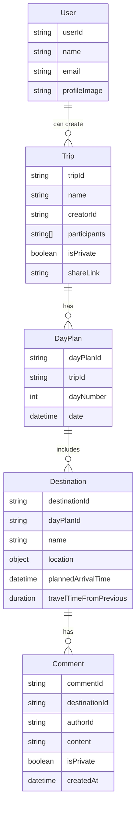
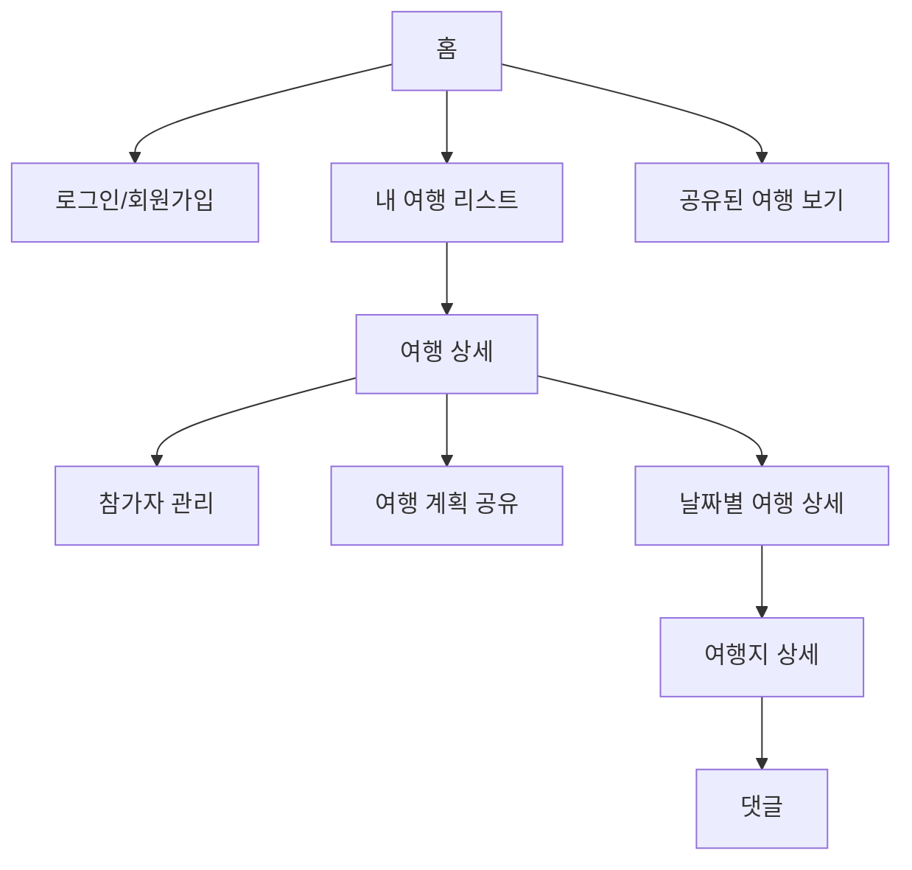
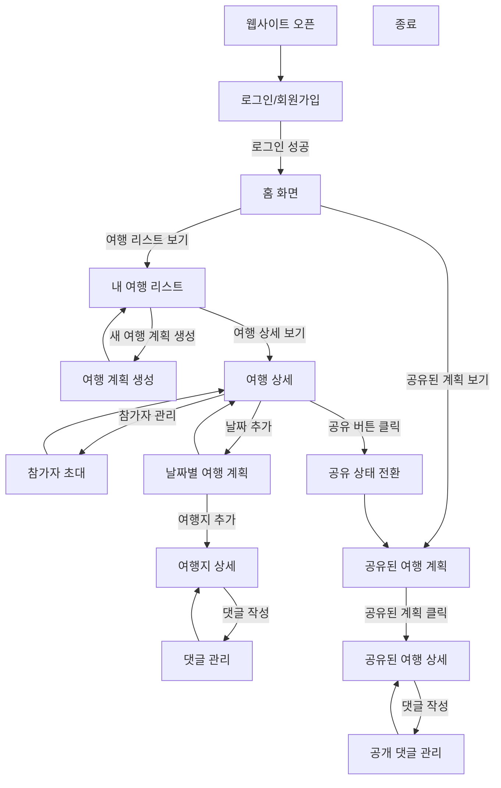

# My-Trip

## IA

## 메뉴구조도

## 유저 플로우

## 깃모지

| Emoji | Gitmoji            | 설명                           |
| ----- | ------------------ | ------------------------------ |
| 🎉    | :tada:             | 첫 번째 커밋                   |
| 🚀    | :rocket:           | 새로운 기능 추가               |
| 🐛    | :bug:              | 버그 수정                      |
| 🔧    | :wrench:           | 환경 설정 또는 사소한 수정사항 |
| 📝    | :memo:             | 문서화 변경                    |
| 💄    | :lipstick:         | UI 관련 변경                   |
| 🎨    | :art:              | 코드 구조 개선                 |
| ⚡    | :zap:              | 성능 개선                      |
| 🔥    | :fire:             | 불필요한 코드 삭제             |
| ✅    | :white_check_mark: | 테스트 추가                    |
| ⚙️    | :gear:             | 설정 변경                      |
| 🔒    | :lock:             | 보안 관련 작업                 |
| 📦    | :package:          | 패키지 업데이트                |
| 🔨    | :hammer:           | 리팩토링                       |
